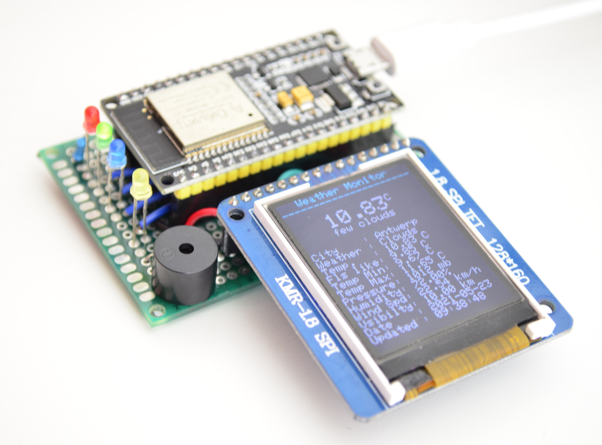

# Weather Monitor Module

## What is it?
This repo shows my attempt to build a wireless _weather monitor module_ which connects to the internet via WiFi and pulling some useful weather status information every let's say 5 minutes. 

<!--  -->


## How does it work?
The brain of the module is [ESP32][esp32ref] microcontroller, a low-powered with built-in WiFi and Bluetooth functionality, which submits an HTTP request to [OpenWeatherMap][openweatherref] as the weather data server. The server returns a response to the ESP32 which contains all the required information. Finally, it reads the data into JSON format, represents them in a TFT display, and reacting to them using , changing the text color, different LED indicators, or generating a gentle beep sound.


## Features
- Wireless connection to WiFi
- Various weather info are available: temperature, feels-like temperature, min/max temperature, pressure, humidity, wind speed, visibility
- Temperature status LEDs: red (hot), green (normal), blue (cold)
- Weather temperature LED (yellow) and buzzer: in case of extre,e weather (e.g. rain or snow)
- Change texts color when a status is not normal (e.g. high wind speed, low visibility, rain) 
- Report date and time of the latest update using NTP client


## Prerequisites
- Access:
    - Connection to a WiFi network 
    - [OpenWeatherMap][openweatherref] enabled API to request weather data (account creation is required, see [here][apikeyref])
- Hardware:
    - [EPS32][esp32ref] microcontroller
    - 1.8 SPI TFT 128x160 display 
    - Four LEDs (red, green, blue, and yellow)
    - A Piezo buzzer
    - Few 100 Ohm resistors for LEDs
    - A breadboard and some wires (or soldering prototype board)
- Software
    - Arduino IDE with [ESP32 Add-on](https://randomnerdtutorials.com/installing-the-esp32-board-in-arduino-ide-windows-instructions/)
    - [Arduino json](https://github.com/bblanchon/ArduinoJson) library
    - [Adafruit TFT display driver](https://github.com/adafruit/Adafruit-ST7735-Library) library


## Wiring
The wiring is pretty straightforward as follows (see [ESP32 Pinout Reference](https://randomnerdtutorials.com/esp32-pinout-reference-gpios/)): 
- TFT display pins:
    - CS ➡ 12    
    - RST ➡ 14    
    - DC  ➡ 13 
    - SCLK ➡ 22   
    - MOSI ➡ 21 
- LEDs pin:
    - Blue  ➡ 25   
    - Green ➡ 26  
    - Red   ➡ 27  
    - Yellow ➡ 32
- Buzzer pin ➡ 15


## Code adjustment
A few parameters have to be known and set before compiling the sketch.
- SSID                  : WiFi network's name
- PASSWORD              : WiFi password
- APIKEY                : Open weather map api key (see the references)
- CITY                  : e.g. "Antwerp"
- COUNTRY               : e.g. "BE"
- TIMEZONE              : Time zone respect to GMT e.g. 7200 for GMT+2h
```CPP
const char* ssid = "SSID";
const char* password = "PASSWORD";

// Your Domain name with URL path or IP address with path (see references)
String openWeatherMapApiKey = "APIKEY";

// Replace with your country code and city
String city = "CITY";                // e.g. "Antwerp"
String countryCode = "COUNTRY";      // e.g. "BE"
unsigned long timezone = "TIMEZONE"  // e.g. 7200 (GMT+2)
```

Blow parameters work just fine with their default values but they can be also adjusted based on your needs.
```CPP
// LED indicators
#define LED_COLD        25    // pin
#define LED_NORM        26    // pin
#define LED_HOT         27    // pin
#define LED_WEATHER     32    // pin

// Set thresholds
#define TEMP_COLD       5.0   // Celsius
#define TEMP_HOT        25.0  // Celsius
#define WIND_SPEED_HIGH 30.0  // km/h 
#define VISIBILITY_LOW  2.0   // km
#define HUMIDITY_HIGH   90.0  // Percent

// Define settings for buzzer
#define BUZZER_PIN      15
#define BUZZER_FRQ      2000
#define BUZZER_CHANNEL  0

// Define pins of TFT screen
#define TFT_CS          12    // pin
#define TFT_RST         14    // pin 
#define TFT_DC          13    // pin
#define TFT_SCLK        22    // pin
#define TFT_MOSI        21    // pin    

// Pulling time in Milliseconds
unsigned long timerDelay = 300000; 
```


## References
Some useful links that part of this work is based on them are as follows:

[esp32ref]: https://en.wikipedia.org/wiki/NodeMCU
[openweatherref]: https://openweathermap.org/
[apikeyref]: https://randomnerdtutorials.com/esp32-http-get-open-weather-map-thingspeak-arduino/
- [ESP32 HTTP GET with Arduino IDE (OpenWeatherMap.org and ThingSpeak)][apikeyref]
- [ESP32 development board with 1.8" SPI TFT LCD 128x160 module](http://acoptex.com/project/1515/basics-project-070p-esp32-development-board-with-18-spi-tft-lcd-128x160-module-at-acoptexcom/#sthash.C8gmE9Za.dpbs)
- [Getting Date and Time with ESP32 on Arduino IDE (NTP Client)](https://randomnerdtutorials.com/esp32-ntp-client-date-time-arduino-ide/)
